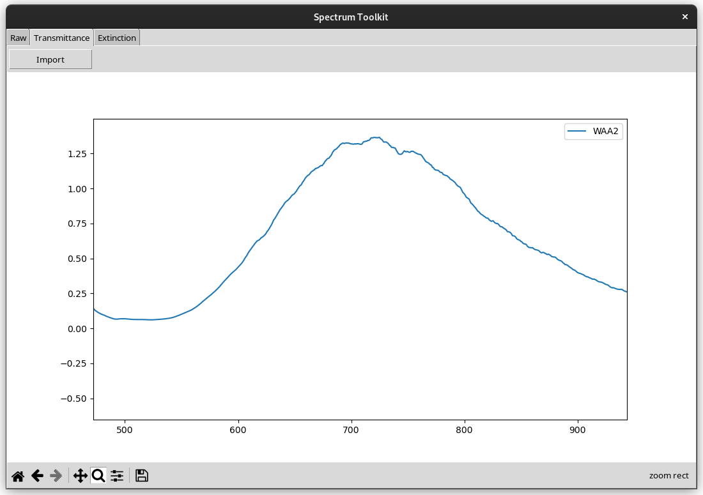
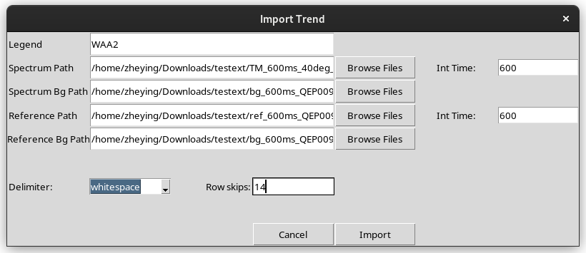

# Introduction
This software is used to analyze spectrums, such as plotting transmission, extinction or process spectral series over time as videos. It also allows you to view multiple spectrums at the same time for side by side comparison, especially useful for applications such as metamaterials sensing.

## Raw
This tab allows you to view simple raw spectrum data.

## Transmittance
This tab calculates the transmittance, taking into account the reference and background spectrum at their respective integration time.

## Extinction
This tab calculates the extinction spectrum using the negative log of the transmittance spectrum

## Video (In progress)
This tab is used to stitch multiple spectrums that are taken at set intervals of time into a video. The video can be exported at various speeds. An option can also be found to preserve certain frames.

# Important Notes!!!
This is just a simple program I made in a night. It is not foolproof. Please try to fill in every option available as some options may not have default values or error handling and might crash the program.

## File Format
This program expects a two column csv text file seperated by either a comma or whitespace.

## Delimiters and Row Skips
This deserves it's own section as the code is very sensitive to these two settings. Currently only whitespace and comma are available. Picking the wrong option WILL cause the program to crash.

Row skip is the number of rows up till your first data point. So if the first data point is on row 13, set row skip to 12. You can view the rows using any text editting software.

# Installation
1. `pip install -r requirements.txt`
2. cd 'directory of this folder'
3. python3 pyspec.py

- Tkinter should be included with python3 as it is a standard library. However, I have noticed that some python3 installation lacks tkinter. If you encounter any issues with Tkinter, do look up the web on how to install that on your device.

# Future Development
- Introducing new feature to plot Tauc plots
- Graph title and axis options
- Relative transmission tab (currently that is sorta doable by replacing the reference with the other spectrum that you intend to compare, assuming the reference and background are the same).
